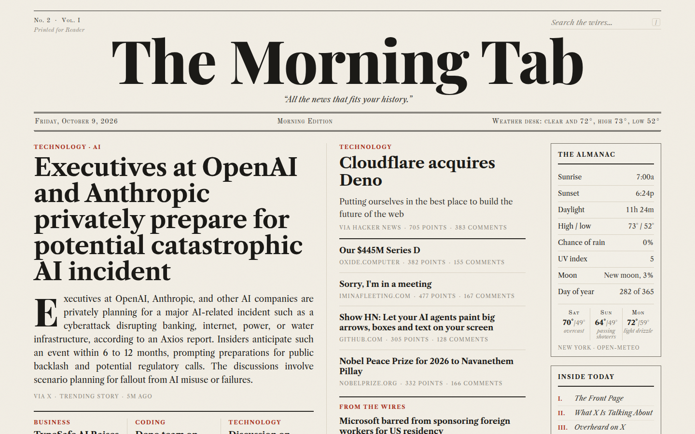

# daily-newsletter

A newspaper-styled browser start page. A [Grok Bot](BOT_SETUP.md) builds it every morning from public wires and, if you ask, from your calendar and mail, then deploys a static site to whatever host you pick.

The default masthead is **The Morning Tab**. The name, tagline, the “Printed for” line, the city, and the timezone are all config.



**With a Grok Bot:** “Set me up from https://github.com/pranavkarthik10/daily-newsletter and follow BOT_SETUP.md.”

The bot holds the setup conversation, writes your config, and runs the daily refresh. You do not need GitHub Actions. [BOT_SETUP.md](BOT_SETUP.md) is the playbook, written to the bot.

## Run it yourself

Python 3.9 or newer. The scripts use the standard library only; there is no `requirements.txt`.

```bash
python3 scripts/preview.py
```

That builds the example edition in `data/sample` and serves it at http://127.0.0.1:8787/. No connectors and no network.

Live public sources (Hacker News, RSS/Atom, Open-Meteo weather):

```bash
python3 scripts/fetch.py
python3 scripts/build.py
python3 scripts/preview.py --live
```

`fetch.py` exits 0 when at least one source succeeded. A feed that fails keeps yesterday's copy when there is one.

`python3 scripts/prepare.py` fetches, builds, and packs the deploy target named in the config. It does not call X, calendar, email, or Vercel. Those are the bot's connectors. See [docs/DEPLOY.md](docs/DEPLOY.md).

`python3 scripts/check.py` rebuilds the sample, checks the secret-path behavior, and runs the ingest fixtures. Offline.

## Config

[`newsletter.config.json`](newsletter.config.json) is the edition. [`config/catalog.json`](config/catalog.json) is a menu of feeds the bot can offer, grouped by interest. Nothing in the catalog is on the page until its object is copied into `feeds` and its id is added to a section.

| Field | Role |
| --- | --- |
| `paper.name`, `tagline`, `edition`, `volume` | Masthead. |
| `paper.reader` | The “Printed for” line. |
| `paper.timezone` | IANA timezone. Issue date, almanac, and “ago” labels. |
| `paper.location` | `name`, `lat`, `lon` for Open-Meteo. `python3 scripts/geocode.py "City"` fills these in. |
| `paper.founded` | Issue number one is this date. The bot sets it to the day you start. |
| `paper.search` | Where the masthead search box submits. Must be `https://`. |
| `routine.time` | Local time of day for the bot's daily routine. The repo has no scheduler. |
| `deploy.target` | `static`, `vercel`, `cloudflare`, or `github-pages`. |
| `deploy.project_name` | Project slug for Vercel and Cloudflare. |
| `feeds` | Enabled sources. `type` is `hn`, `rss`, `lobsters`, `hf_papers`, or `json`. |
| `sections` | Public desks. `kind` is `hn`, `feeds`, `x_news`, `x_posts`, or `items`. |
| `private_sections` | Calendar, email, and any extra connector desk. **Off unless `enabled` is true.** |
| `front.wires`, `front.brief_topics`, `front.lead_topic` | What leads the front page. |

Section fields worth knowing: `kicker`, `title`, `show` (visible before “more”), `max`, `per_feed`, `feeds`, `topic`, `queries`, `accounts`, `placement` (`section` or `sidebar`).

Private sections are listed in the file and disabled. Turning any of them on publishes the paper only under a random path. See Privacy below.

Connector JSON (`data/x.json`, `data/calendar.json`, `data/email.json`, `data/sections/<id>.json`) is specified in [docs/SCHEMAS.md](docs/SCHEMAS.md). `scripts/ingest.py` reshapes raw Google, Microsoft Graph, Gmail, and X payloads into those files.

## Deploy

The build writes a static folder to `dist/site/`, plus a packer for the target you chose.

- **Vercel** — `scripts/deploy_vercel.py` writes `dist/vercel/deploy_args.json` for the Vercel connector's `create_deployment`. No token in the repo.
- **Cloudflare Pages / Workers** — `scripts/deploy_cloudflare.py` uploads with an API token, or you use Wrangler. `dist/cloudflare/wrangler.toml` is the Workers static-assets config.
- **GitHub Pages** — `scripts/deploy_github_pages.py` force-updates a `gh-pages` branch and does not touch `main`.
- **Anywhere else** — upload `dist/site`.

Credentials, project creation, and the private-path layout are in [docs/DEPLOY.md](docs/DEPLOY.md).

## Add a source

1. Copy a feed from `config/catalog.json` into `feeds`, or add your own `{id, name, type, url}`.
2. Add the id to a section's `feeds`, or add a section.
3. `python3 scripts/fetch.py && python3 scripts/build.py`, then deploy again.

A custom connector desk is an `items` section that reads `data/sections/<id>.json`. The disabled `notebook` entry in `private_sections` is the template. New kinds, if a list of links is not enough, are a renderer registered in `scripts/build.py` (`RENDERERS` / `SIDEBAR`).

## Privacy

With every private section disabled, the paper is the site root.

With any private section enabled, the build writes the paper to `dist/site/<secret>/`, leaves a blank `noindex` page at `/`, and sends `robots.txt` that disallows `/`. The secret is created once in `.secret_path` (gitignored) and reused. It is the only access control: anyone with the URL can read the page. Don't commit it, and don't put a private edition on a public `gh-pages` branch. The deploy script refuses that case.

`data/` (live fetches and connector files) and `dist/` are gitignored. `data/sample/` is example content for the preview, not a real inbox or calendar.

## Layout

```
newsletter.config.json    your edition
config/catalog.json       suggested feeds by interest
BOT_SETUP.md              instructions for the bot
docs/SCHEMAS.md           connector JSON
docs/DEPLOY.md            hosts and credentials
scripts/fetch.py          HN, RSS, weather
scripts/ingest.py         connector payloads → data/*.json
scripts/build.py          dist/site
scripts/preview.py        local server
scripts/prepare.py        fetch + build + pack
scripts/deploy.py         pack or publish the configured target
site/                     CSS, JS, self-hosted fonts
data/sample/              example edition
```

Fonts (Playfair Display, Libre Caslon Text, Libre Caslon Display, Old Standard TT) are SIL Open Font License subsets. See `site/fonts/OFL.txt`.

## License

[MIT](LICENSE).
